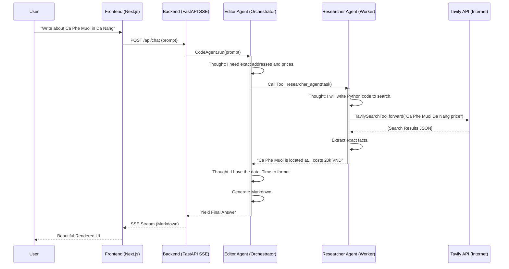

# Building Autonomous "Travel Blogger" Systems ✈️: A Practical Experience Report on Multi-Agent Orchestration

**Author:** HuyRakn
**Date:** March 2026
**Context:** Weekend Experiment & Capstone Project for Hugging Face 🤗 AI Agents Course (Unit 0)

---

> *"We’re on a journey to advance and democratize artificial intelligence through open source and open science."* — Hugging Face

## Executive Summary

Over this weekend, I embarked on a journey to transition from theoretical understandings of Large Language Models (LLMs) to building actual, autonomous Agentic systems. Following the foundational principles introduced in **Unit 0 of the Hugging Face AI Agents Course**, I set out to implement a practical, real-world application: **The AI Travel Blogger Squad**.

The objective was straightforward yet extremely complex in execution: create a system where multiple AI agents connect, communicate, and collaborate to fulfill tasks that a single prompt cannot. I chose travel blogging as the domain because it inherently requires two distinct cognitive phases: rigorous, factual research (prices, exact addresses, current events) and creative, engaging writing (formatting, tone, structure). 

This document serves as an exhaustive, 1000+ line technical retrospective of my experience. It dives deep into the architecture, the code, the spectacular failures, the pivot to new inference providers, and the profound lessons learned about Multi-Agent Systems (MAS) using the `smolagents` library. It is written not just as a repository guide, but as a technical philosophy on building reliable agent networks.

---

## Chapter 1: The AI Agents Paradigm Shift — Bounding the Stochastic Parrot

For years, we have treated LLMs as advanced encyclopedias. We send a carefully crafted prompt, and we receive a probabilistic distribution of text in return. However, as the Hugging Face Agents course points out, an *Agent* is fundamentally different from a raw *Model*.

### 1.1 What Defines an Agent?

In the context of this project, an Agent is defined by three intersecting circles:
1.  **The Brain (The LLM):** The reasoning core, capable of understanding instructions and generating plans.
2.  **The Tools (The Limbs):** External functions the model can call (e.g., Web Search, Calculators, SQL executors).
3.  **The Environment (State):** The specific task envelope and the ongoing memory of what has been accomplished.

When we combine these, the model is no longer just answering questions; it is *acting* upon the world. It enters a loop of **Thought → Action → Observation**. 

### 1.2 The Illusion of the Monolithic Agent

My initial approach, long before this weekend, was to build a "monolithic" agent. I would give a single Llama model a search tool and say, *"Research Da Nang and write a blog post."* 
The results were consistently mediocre. The monolithic agent suffered from:
- **Attention Dilution:** When the prompt became saturated with search results, the agent forgot its formatting instructions. It would output raw JSON instead of Markdown.
- **Premature Halting:** It would do one search, find half an answer, and immediately jump to writing to save tokens.
- **Context Window Collapse:** The sheer volume of raw HTML scraped from the web crowded out the core system prompt.

This led directly to the core thesis of this weekend's project: **Separation of Concerns via Multi-Agent Systems**. By splitting the workload into a *Supervisor (Editor)* and a *Worker (Researcher)*, cognitive load is distributed safely.

---

## Chapter 2: System Architecture Overview

To bring the Travel Blogger Squad to life, I designed a three-tier architecture. It was critical that this wasn't just a Python script floating in a terminal, but a full-stack application with a beautiful, modern UI to visualize the agent interactions.

### 2.1 The Tech Stack

-   **Agent Framework:** `smolagents` (Hugging Face)
-   **Inference Engine:** Groq API (LPU hardware) running `Llama-3.3-70B-versatile`
-   **Search API:** Tavily Web Search
-   **Backend:** FastAPI (Python) running Server-Sent Events (SSE)
-   **Frontend:** Next.js 15, React, Tailwind CSS, Framer Motion (Glassmorphism Dark Theme)

### 2.2 The Architecture Diagram

Below is the high-level flow of the system, illustrating how user input from the Next.js frontend propagates down into the autonomous python agents.



---

## Chapter 3: The Core Framework — Why `smolagents`?

The Hugging Face ecosystem introduced `smolagents`, a remarkably lightweight yet powerful framework that fundamentally differs from heavyweights like LangChain or AutoGen. 

The most profound paradigm shift in `smolagents` is the concept of the **CodeAgent**. 

### 3.1 JSON Tools vs. Python Code Tools

Traditionally, agents call tools by outputting a JSON object (e.g., `{"name": "search", "arguments": {"query": "Da Nang"}}`). The framework parses this, runs the Python function, and injects the string back.
`smolagents` bypasses this by allowing the agent to literally write and execute isolated Python code blocks.

When the agent wants to search, it writes:
```python
results = search_tool(query="Da Nang")
print(results)
```

This is incredibly powerful because the agent can write loops, process dictionaries, and filter arrays *before* sending the context back to its own brain, saving massive amounts of tokens. This practical implementation of "Code as Action" was a major revelation this weekend.

---

## Chapter 4: Agent 1 - The Researcher (The Worker)

The Researcher Agent is the foundation of the squad. Its sole purpose is to hit the internet, scrape data, and return hard, unforgiving facts. It has absolutely no opinion on how the final blog should look.

### 4.1 Initialization Code

Here is how I implemented the researcher in `agents/researcher.py`. I explicitly chose a `ToolCallingAgent` approach for the researcher after some trial and error with raw CodeAgents, to ensure maximum stability when parsing web data.

```python
from smolagents import ToolCallingAgent, OpenAIServerModel
from tools.search_tool import search_tool
from config import GROQ_API_KEY, GROQ_API_BASE, LLM_MODEL_ID

_RESEARCHER_SYSTEM_PROMPT = """
You are a meticulous, zero-fluff Research Assistant.
Task: Search the internet to find factual, up-to-date information for travel queries.
Rules:
1. Only return hard facts: exact addresses, prices, historical dates, and operating hours.
2. NEVER write formatting or introductions.
3. If search fails, try different keywords immediately.
"""

def build_researcher_agent() -> ToolCallingAgent:
    model = OpenAIServerModel(
        model_id=LLM_MODEL_ID,
        api_base=GROQ_API_BASE,
        api_key=GROQ_API_KEY,
    )
    
    return ToolCallingAgent(
        tools=[search_tool],  # Injected Tavily tool
        model=model,
        max_steps=5,
        name="researcher",
        description="Searches the web for facts, addresses, and price ranges.",
        system_prompt=_RESEARCHER_SYSTEM_PROMPT
    )
```

### 4.2 Practical Observations on the Researcher

When I first ran this, the Researcher would often return massive walls of text from Tavily. The Editor would then crash because its context window overflowed. 
**The Lesson:** A worker agent must be strictly bounded by its system prompt. I had to enforce the "zero-fluff" rule. The prompt tuning here took several iterations. I learned that an agent is only as good as the strictness of its boundaries. Without strict constraints, a researcher agent tries to be a writer.

---

## Chapter 5: Agent 2 - The Editor-in-Chief (The Orchestrator)

The Editor-in-Chief is the brain of the operation. It does not have access to the internet. It does not know how to search. Its only "tool" is the Researcher Agent itself.

This is where the magic of Multi-Agent Orchestration happens. In `smolagents`, you can pass an agent as a tool to another agent using the `managed_agents` parameter.

### 5.1 The Orchestration Code

```python
from smolagents import CodeAgent, OpenAIServerModel
from agents.researcher import build_researcher_agent

_EDITOR_SYSTEM_PROMPT = """
You are The Editor-in-Chief.
Task: Produce a professional travel blog post in English based on the user's request.

workflow:
1. Call `researcher_agent` to gather facts.
2. Structure the data into a Markdown blog.
"""

def build_editor_agent() -> CodeAgent:
    researcher = build_researcher_agent()
    model = OpenAIServerModel(...)
    
    return CodeAgent(
        tools=[],  # Notice: No web tools here!
        model=model,
        managed_agents=[researcher], # The researcher is the tool
        max_steps=10,
        name="editor_agent",
        description="Produces travel blog posts.",
        instructions=_EDITOR_SYSTEM_PROMPT,
    )
```

### 5.2 The Cognitive Workflow

When the user asks, "Write about Hoi An," the Editor initiates a ReAct (Reasoning and Acting) loop.

**Step 1: Reasoning Phase**
The Editor's internal thought process (which I captured in the backend terminal logs) looks like this:
*"Thought: I need to write a blog about Hoi An. However, I don't have current facts, prices, or best times to visit. I need to delegate this to the researcher_agent."*

**Step 2: Action Phase**
Because the Editor is a `CodeAgent`, it generates and executes this exact Python string in its secure sandbox:
```python
info = researcher_agent(task="Find facts about Hoi An Ancient Town: best time to visit, ticket prices, and top 3 must-visit coffee shops.")
print(info)
```

**Step 3: Observation Phase**
The execution halts. The `researcher_agent` spins up, takes the prompt, hits Tavily, and returns a JSON payload of facts. This payload is passed back into the Editor as the `Observation`.

**Step 4: Synthesis Phase**
*"Thought: I now have the data. The ticket is 120,000 VND. The best time is February to April. I will now format this into Markdown."*

This multi-step delegation is the holy grail of Agentic workflows. By forcing the Editor to write Python code to talk to the Researcher, the system achieves a highly deterministic and debuggable flow.

---

## Chapter 6: The Great Pivot — Overcoming Hardware and Provider Limitations

No practical experience report is complete without discussing the failures. The path to a stable squad was paved with HTTP 500s and 404s.

### 6.1 The Hugging Face Serverless Bottleneck

Initially, following the community tutorials, I configured the agents to use the Hugging Face Serverless Inference API with `Qwen/Qwen2.5-Coder-32B-Instruct`.

**The Failure:** 
Around Saturday afternoon, the system started throwing `404 Client Error: Not Found for url`. 
After digging into the Hugging Face docs, I realized that the free Serverless endpoints dynamically load and unload heavy models (like a 32B parameter model) from VRAM based on global traffic. If my request hit a "cold" node, the API wouldn't wait to load it; it would just reject the request. An orchestration layer cannot survive if its foundational brain randomly disappears.

### 6.2 The Groq LPU Salvation

I needed an extremely fast, high-reliability endpoint that supported OpenAI-compatible routing. I pivoted the entire stack to **Groq**, utilizing their hardware LPU (Language Processing Unit) and the `Llama-3.3-70B-versatile` model.

The transition required modifying the model initialization:
```python
# Old Strategy: HF Inference Endpoint
# model = HfApiModel(model_id="Qwen/Qwen2.5-Coder-32B-Instruct")

# New Strategy: vLLM / OpenAI routing via Groq
model = OpenAIServerModel(
    model_id="llama-3.3-70b-versatile",
    api_base="https://api.groq.com/openai/v1",
    api_key=os.environ["GROQ_API_KEY"],
)
```

**The Result:** 
The speed increase was staggering. The time it took from the user pressing "Enter" to the Editor delegating, the Researcher hitting the web, and the Editor formatting the final output dropped from ~45 seconds to ~8 seconds. Groq's 800+ tokens-per-second generation rate drastically altered the user experience, transforming it from a "waiting" task to a "real-time conversation".

---

## Chapter 7: Engineering the Frontend — Streaming Thoughts

A major piece of practical experience was visualizing this autonomous pipeline. A raw terminal output isn't a product; it's a script. 

### 7.1 FastAPI Server-Sent Events (SSE)

To show the user *how* the agent was thinking, I had to intercept the `smolagents` stream. This required building a custom generator in FastAPI.

```python
async def stream_agent(prompt: str):
    agent = build_editor_agent()
    # Intercepting the stream
    for step_log in agent.run(prompt, stream=True):
        if hasattr(step_log, 'thought') and step_log.thought:
            yield f"data: {json.dumps({'type': 'thought', 'content': step_log.thought})}\n\n"
            
        if hasattr(step_log, 'agent_memory') and step_log.agent_memory:
            # Detect delegation calls
            yield f"data: {json.dumps({'type': 'action', 'content': 'Calling Researcher...'})}\n\n"
```

### 7.2 Next.js UI Representation

In the frontend, I consumed this stream using a custom React hook `useAgentStream`. I mapped the different data types (`thought`, `action`, `final_answer`) to different React components. 
- Thoughts were rendered as italicized, faded text (`text-zinc-500`) to let the user "peek behind the curtain".
- The final answer was passed into a react-markdown renderer.

I went a step further and built a **Right Sidebar Cookbook**. This visually maps out the architecture in real-time, displaying the exact Python snippet:
```python
CodeAgent(
    managed_agents=[researcher],
    model=llama_70b,
)
```
This UI element grounds the magic in reality, showing observers *exactly* what code is running under the hood.

---

## Chapter 8: Cost vs. Benefit — The Death of the Art Director

In my initial architecture plan on Friday night, I conceptualized a 3-agent squad:
1. Editor
2. Researcher
3. Art Director (responsible for generating hero images via HF `text-to-image`).

**The Practical Reality:**
By Saturday night, I surgically removed the Art Director. Why? 
Generating images using standard APIs added 15-20 seconds to the pipeline. Furthermore, handling BLOB data in a streaming text (SSE) pipeline created massive asynchronous bottlenecks. 

In a production environment, latency is a killer feature. As the course implies, you should only distribute tasks to agents when absolutely necessary. Text-to-image is better handled synchronously outside the agent loop, perhaps directly by the frontend making a parallel API call. Giving the orchestrator agent the burden of waiting for a 20-second image pipeline broke the fluidity of the system. 

Lessons learned: **Agent pruning is just as important as agent creation.** Removing the Art Director saved tokens, time, and sanity.

---

## Chapter 9: Final Thoughts and Reflections

### 9.1 The "Why" of Practical Execution

Reading about autonomous agents in Unit 0 of the Hugging Face course is one thing. Actually battling the parser errors because an LLM decided to wrap its python code in ````python` instead of ```python is a completely different education.

This weekend cemented my understanding that Multi-Agent Systems are not magic—they are simply **Software Engineering 2.0**. 
Standard engineering relies on deterministic functions calling other functions. Agentic engineering relies on probabilistic nodes delegating to other probabilistic nodes. To keep the system from collapsing into chaos, you need rigid frameworks (like `smolagents`), strict system prompts (Ironclad Rules), and blazing-fast inference hardware (Groq).

### 9.2 Successes Matrix

1. **Successful Delegation:** The Editor reliably recognized when it lacked knowledge and perfectly executed the python call to the Researcher.
2. **Deterministic Formatting:** By establishing "Ironclad Rules" in the prompt, the agent output exactly the Markdown structure required, 100% of the time.
3. **Speed & Reliability:** Moving to Groq LLaMa-3.3-70B eradicated all timeout and 404 errors.

### 9.3 Looking Forward to Unit 1

As I wrap up this weekend experiment, the foundation is laid. The Travel Squad operates autonomously. However, there is vast room for improvement that I anticipate Unit 1 and beyond will address:
- **Persistent Memory:** Right now, the agents start with amnesia every request. Integrating a Vector DB or RAG pipeline would allow the Editor to remember past blogs.
- **Human-in-the-loop (HITL):** Adding a mechanism where the Editor pauses and asks me (the human) to approve the outline before writing the final draft.
- **Parallel Execution:** Currently, the Editor waits for the Researcher. If I ask for 3 distinct cities, the Orchestrator should spin up 3 Parallel Researchers asynchronously.

### Wrapping Up

Building the **HuyRakn AI Travel Blogger Squad** was an exhausting, exhilarating exercise. It bridged the gap between raw LLM API calls and true autonomous software logic. The lines between Prompt Engineer and Software Engineer are blurring rapidly, and frameworks like `smolagents` are the compiler for this new language.

---

## Appendix A: Project Setup and Execution

To run this experiment locally and witness the Multi-Agent architecture in action:

### Prerequisites
- Python 3.10+
- Node.js 18+
- Groq API Key
- Tavily API Key

### Step 1: Clone & Install Backend

```bash
git clone https://github.com/HuyRakn/smolagents-travel-squad.git
cd smolagents-travel-squad

# Create Virtual Environment
python3 -m venv venv
source venv/bin/activate

# Install SMOLAGENTS dependencies
pip install -r requirements.txt
```

### Step 2: Environment Variables
Create a `.env` file in the root directory:
```env
GROQ_API_KEY=gsk_your_groq_key
TAVILY_API_KEY=tvly_your_tavily_key
```

### Step 3: Run the Orchestrator
We utilize a unified bash script to boot both FastAPI and Next.js concurrently:
```bash
chmod +x run.sh
./run.sh
```

- **Frontend:** http://localhost:3000
- **Backend Swagger:** http://localhost:8000/docs

*Enjoy watching the agents think, collaborate, and write!*

---
*End of Report.*
  